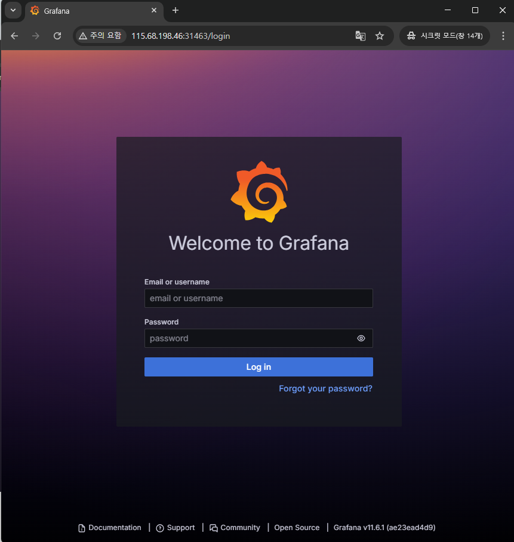
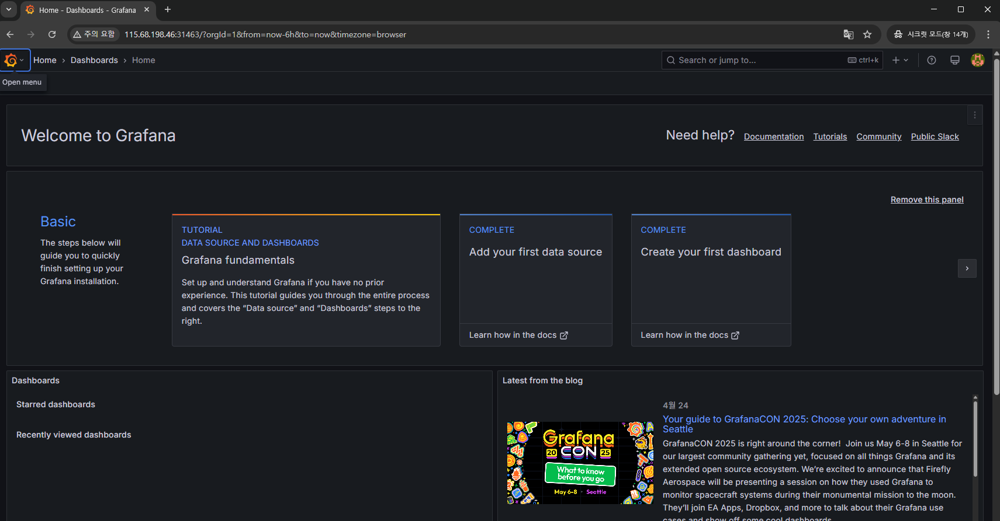
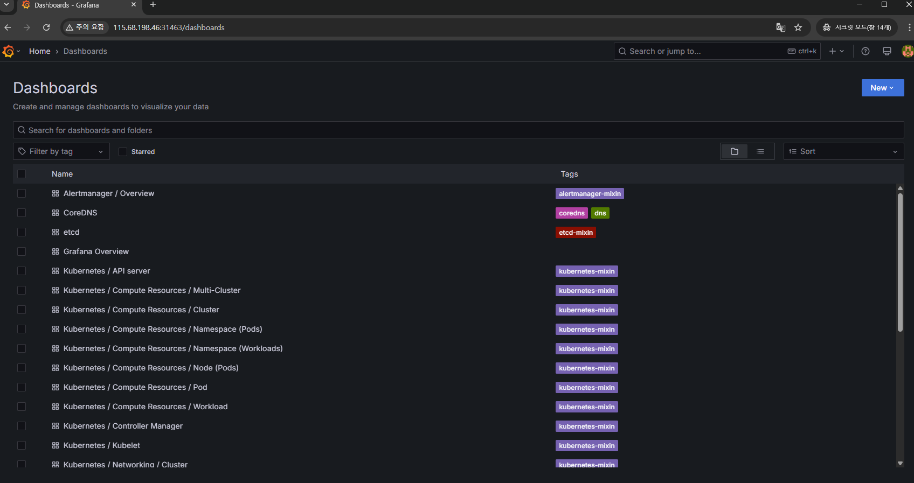
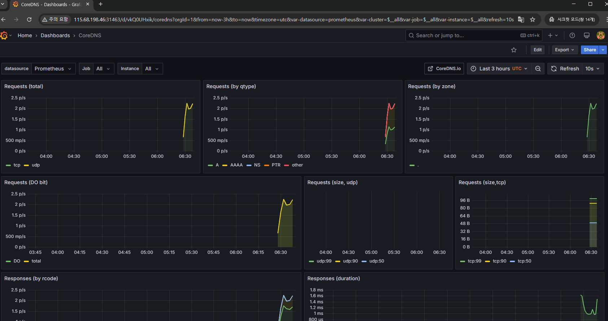

#  prometheus + grafana 모니터링 

## Table of Contents

1. [Prometheus & Grafana](#1)<br>
  1.1. [namespace 생성](#1.1)<br>
  1.2. [프로메테우스 커뮤니티를 helm-chart에 등록](#1.2)<br>
  1.3. [helm repo 업데이트](#1.3)<br>
  1.4. [Prometheus & Grafana 설치](#1.4)<br>
  1.5. [설치 확인](#1.5)<br>
  1.6. [외부접속을 위해 nodeport로 변경해주기](#1.6)<br>
  1.7. [접속](#1.7)<br>


* 환경 : 마스터 노드 1개 워커노드 2개 총 3개의 노드로 이루어진 클러스터를 사용

test-cluster-1/ master node     <br>
test-cluster-2/ worker node     <br>
test-cluster-5/ worker node · nfs <br>

스펙

ubuntu 22.04 <br>
kubernetes version 1.30.4


# <div id='1'> 1. Prometheus & Grafana

### <div id='1.1'> 1.1. namespace 생성

- namespace 생성

```
$ kubectl create namespace monitoring
```
ubuntu@test-cluster-1:~$ kubectl get ns
NAME              STATUS   AGE
monitoring        Active   2s


### <div id='1.2'> 1.2. 프로메테우스 커뮤니티를 helm-chart에 등록


```
ubuntu@test-cluster-1:~/workspace/sun/sub$ helm repo add prometheus-community https://prometheus-community.github.io/helm-charts
"prometheus-community" has been added to your repositories
```

### <div id='1.3'> 1.3. helm repo 업데이트


```
ubuntu@test-cluster-1:~/workspace/sun/sub$ helm repo update
Hang tight while we grab the latest from your chart repositories...
...Successfully got an update from the "cp-chart-repository" chart repository
...Successfully got an update from the "prometheus-community" chart repository
...Successfully got an update from the "gitlab" chart repository
Update Complete. ⎈Happy Helming!⎈
```

### <div id='1.4'> 1.4. Prometheus & Grafana 설치


```
ubuntu@test-cluster-1:~/workspace/sun/sub$ helm install prometheus prometheus-community/kube-prometheus-stack --namespace monitoring
W0425 06:25:50.885285 1490774 warnings.go:70] would violate PodSecurity "restricted:v1.30": host namespaces (hostNetwork=true, hostPID=true), allowPrivilegeEscalation != false (container "node-exporter" must set securityContext.allowPrivilegeEscalation=false), unrestricted capabilities (container "node-exporter" must set securityContext.capabilities.drop=["ALL"]), restricted volume types (volumes "proc", "sys", "root" use restricted volume type "hostPath"), seccompProfile (pod or container "node-exporter" must set securityContext.seccompProfile.type to "RuntimeDefault" or "Localhost")
NAME: prometheus
LAST DEPLOYED: Fri Apr 25 06:25:28 2025
NAMESPACE: monitoring
STATUS: deployed
REVISION: 1
NOTES:
kube-prometheus-stack has been installed. Check its status by running:
  kubectl --namespace monitoring get pods -l "release=prometheus"

Get Grafana 'admin' user password by running:

  kubectl --namespace monitoring get secrets prometheus-grafana -o jsonpath="{.data.admin-password}" | base64 -d ; echo

Access Grafana local instance:

  export POD_NAME=$(kubectl --namespace monitoring get pod -l "app.kubernetes.io/name=grafana,app.kubernetes.io/instance=prometheus" -oname)
  kubectl --namespace monitoring port-forward $POD_NAME 3000

Visit https://github.com/prometheus-operator/kube-prometheus for instructions on how to create & configure Alertmanager and Prometheus instances using the Operator.
```
### <div id='1.5'> 1.5. 설치 확인


```
ubuntu@test-cluster-1:~/workspace/sun/sub$ kubectl get pods -n monitoring
NAME                                                     READY   STATUS    RESTARTS   AGE
alertmanager-prometheus-kube-prometheus-alertmanager-0   2/2     Running   0          7m18s
prometheus-grafana-7ffcbc7c9c-nbvx9                      3/3     Running   0          7m33s
prometheus-kube-prometheus-operator-7d9948fcc7-8zl4h     1/1     Running   0          7m33s
prometheus-kube-state-metrics-747cd58954-m8xk8           1/1     Running   0          7m33s
prometheus-prometheus-kube-prometheus-prometheus-0       2/2     Running   0          7m18s
prometheus-prometheus-node-exporter-sgvwl                1/1     Running   0          7m33s
prometheus-prometheus-node-exporter-vd9r6                1/1     Running   0          7m34s
prometheus-prometheus-node-exporter-xqq6w                1/1     Running   0          7m33s
```

### <div id='1.6'> 1.6. 외부접속을 위해 nodeport로 변경해주기


1. 서비스 yaml 수정을 위해 edit 명령어를 사용해 서비스 수정

```
ubuntu@test-cluster-1:~/workspace/sun/sub$ kubectl edit svc prometheus-grafana -n monitoring


apiVersion: v1
kind: Service
metadata:
  annotations:
    meta.helm.sh/release-name: prometheus
    meta.helm.sh/release-namespace: monitoring
  creationTimestamp: "2025-04-25T06:25:50Z"
  labels:
    app.kubernetes.io/instance: prometheus
    app.kubernetes.io/managed-by: Helm
    app.kubernetes.io/name: grafana
    app.kubernetes.io/version: 11.6.1
    helm.sh/chart: grafana-8.13.1
  name: prometheus-grafana
  namespace: monitoring
  resourceVersion: "12575316"
  uid: 0ce95c74-25d3-46dc-9a7c-4cb1344f8e74
spec:
  clusterIP: 10.233.17.33
  clusterIPs:
  - 10.233.17.33
  externalTrafficPolicy: Cluster
  internalTrafficPolicy: Cluster
  ipFamilies:
  - IPv4
  ipFamilyPolicy: SingleStack
  ports:
  - name: http-web
    nodePort: 31463
    port: 80
    protocol: TCP
    targetPort: 3000
  selector:
    app.kubernetes.io/instance: prometheus
    app.kubernetes.io/name: grafana
  sessionAffinity: None
  type: ClusterIP        ## NodePort로 변경 > NodePort


ubuntu@test-cluster-1:~/workspace/sun/sub$ kubectl edit svc prometheus-grafana -n monitoring
service/prometheus-grafana edited

```

### <div id='1.7'> 1.7. 접속


1. 접속을 위한 포트 확인

```  
  ubuntu@test-cluster-1:~/workspace/sun/sub$ kubectl get svc -n monitoring
NAME                                      TYPE        CLUSTER-IP      EXTERNAL-IP   PORT(S)                      AGE
alertmanager-operated                     ClusterIP   None            <none>        9093/TCP,9094/TCP,9094/UDP   9m37s
prometheus-grafana                        NodePort    10.233.17.33    <none>        80:31463/TCP                 9m53s
prometheus-kube-prometheus-alertmanager   ClusterIP   10.233.11.136   <none>        9093/TCP,8080/TCP            9m53s
prometheus-kube-prometheus-operator       ClusterIP   10.233.39.101   <none>        443/TCP                      9m53s
prometheus-kube-prometheus-prometheus     ClusterIP   10.233.36.39    <none>        9090/TCP,8080/TCP            9m53s
prometheus-kube-state-metrics             ClusterIP   10.233.41.163   <none>        8080/TCP                     9m53s
prometheus-operated                       ClusterIP   None            <none>        9090/TCP                     9m37s
prometheus-prometheus-node-exporter       ClusterIP   10.233.19.150   <none>        9100/TCP                     9m53s

```

2. 접속

{mater node ip}:31463 접속


 


- login 
 
 (초기 아이디, 패스워드)<br>
 id: admin <br>
 password: prom-operator


- login 후 화면 

 

3. 대시보드 확인

- 좌측 상단의 dashboard 선택 

 

- 모니터링 하고 싶은 목록 선택 

 
